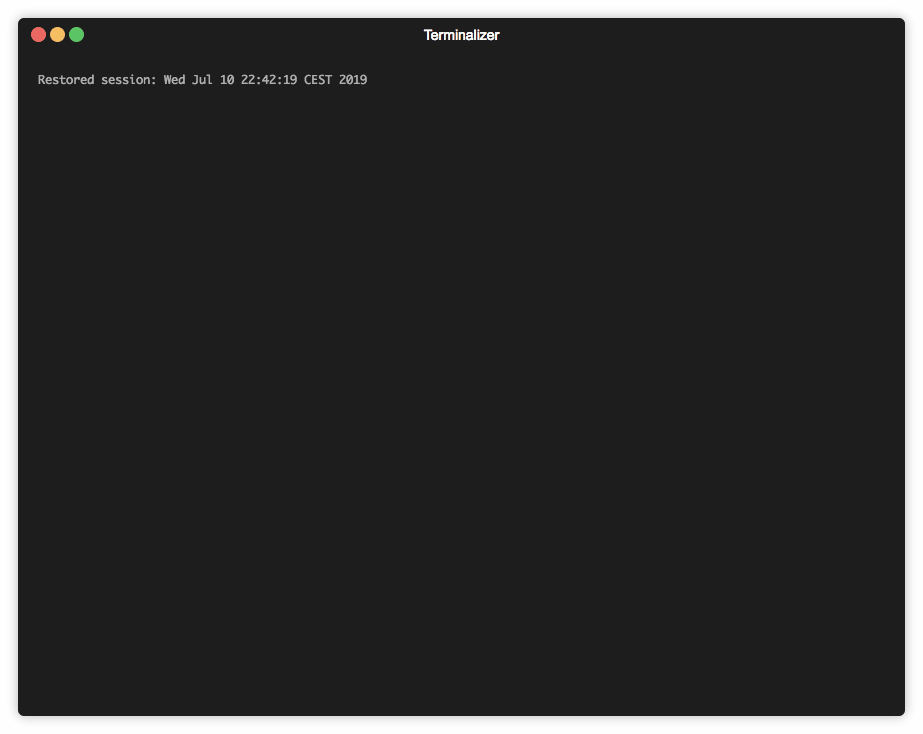

## ft_select

Autocomplete part for https://github.com/hugohow/42sh

Based on termcaps lib.




### No memory leaks. (Valgrind certified)

## Usage

```
usage: ./ft_select arg1 arg2 arg3 ...
```

### OSX :

```
make re
./ft_select
```

### Linux :

```
sudo apt-get install -y libncurses5-dev
make re
./ft_select
```

